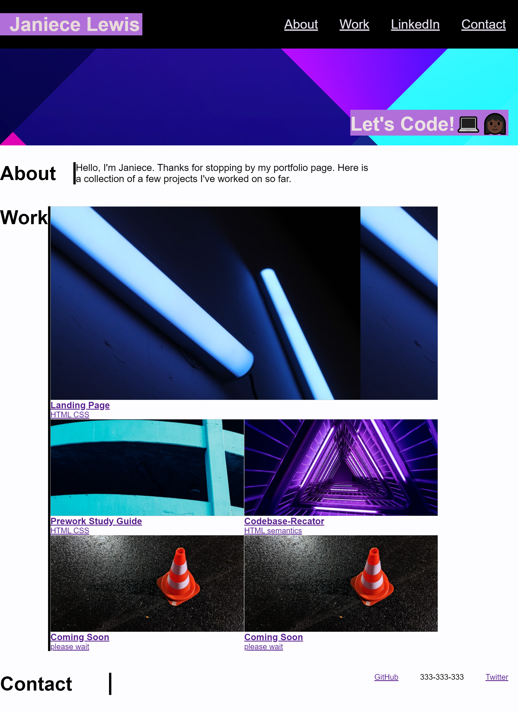

# my-portfolio

The assignment was to create a profile displaying current projects.

## Table of contents

- [Usage](#usage)
- [Preview](#preview)
- [Contributing](#contributing)
- [License](#license)

##

```
As a user
I want to display my work to a potential employers.A deployed portfolio of work samples
so that future employers can review samples of users' work and assess whether they're a good candidate for an open position
```



[Deployed Link](https://janiece-lewis.github.io/my-portfolio/)

## Contributing
Pull requests are welcome. For major changes, please open and issue first to discuss what you would like to change.


## License
[MIT](https://choosealicense.com/licenses/mit/)
